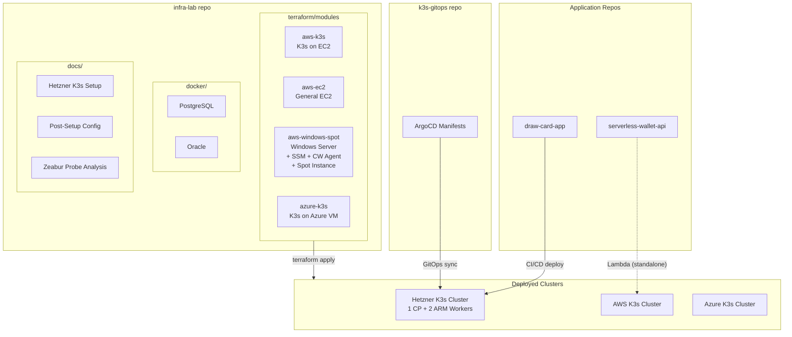

# infra-lab

Infrastructure-as-Code playground — Terraform modules, Docker compositions, and technical documentation from my homelab journey.

基礎設施即程式碼練習場 — 涵蓋 Terraform 模組、Docker 組合配置，以及 Homelab 建置過程中的技術文件。

---

## Architecture Overview / 架構總覽



---

## Repository Structure / 目錄結構

```
infra-lab/
├── terraform/
│   ├── modules/
│   │   ├── aws-k3s/              # K3s cluster on AWS EC2
│   │   │                         # AWS EC2 上建立 K3s 叢集
│   │   ├── aws-ec2/              # General-purpose EC2 instances
│   │   │                         # 通用 EC2 執行個體
│   │   ├── aws-windows-spot/     # Windows Server on Spot + SSM + CloudWatch
│   │   │                         # Spot 執行個體上的 Windows Server + SSM + CW Agent
│   │   └── azure-k3s/            # K3s cluster on Azure VM
│   │                             # Azure VM 上建立 K3s 叢集
│   └── envs/
│       ├── dev/                  # Dev environment configs
│       └── prod/                 # Prod environment configs (template)
├── docker/
│   ├── pgsql/                    # PostgreSQL compose stack
│   └── oracle/                   # Oracle compose stack
├── docs/
│   ├── hetzner-k3s-setup.md      # Hetzner K3s cluster bootstrap guide
│   │                             # Hetzner K3s 叢集建置指南
│   ├── post-setup-config.md      # Post-install configuration (monitoring, certs, etc.)
│   │                             # 安裝後組態設定（監控、憑證等）
│   └── zeabur-probe-analysis.md  # Reverse-engineering Zeabur's health probe mechanism
│                                 # 逆向分析 Zeabur 健康檢查探針機制
├── .gitignore
├── LICENSE
└── README.md
```

---

## Modules / 模組說明

### `terraform/modules/aws-k3s`

Provisions EC2 instances and bootstraps a K3s cluster via user-data scripts. Supports both control plane and worker node configurations.

在 AWS EC2 上透過 user-data 腳本自動建立 K3s 叢集，支援 control plane 與 worker node 配置。

### `terraform/modules/aws-ec2`

General-purpose EC2 module for experimentation and labs.

通用 EC2 模組，用於實驗與練習。

### `terraform/modules/aws-windows-spot`

Windows Server on Spot Instances with SSM Session Manager (no SSH needed) and CloudWatch Agent for monitoring. Demonstrates cost optimization + secure remote access + observability.

使用 Spot Instance 執行 Windows Server，搭配 SSM Session Manager（免開 SSH）與 CloudWatch Agent 進行監控。展示成本優化 + 安全遠端存取 + 可觀測性。

### `terraform/modules/azure-k3s`

K3s cluster provisioning on Azure VMs. Mirrors the AWS module structure for multi-cloud comparison.

在 Azure VM 上建立 K3s 叢集，結構對應 AWS 模組，方便多雲比較。

### `docker/`

Docker Compose stacks for local database development — PostgreSQL and Oracle.

本機資料庫開發用的 Docker Compose 配置 — PostgreSQL 與 Oracle。

---

## Related Repositories / 相關專案

| Repo | Description |
|------|-------------|
| [`k3s-gitops`](https://github.com/changken/k3s-gitops) | ArgoCD manifests for GitOps-managed deployments on K3s cluster<br/>K3s 叢集上由 ArgoCD 管理的 GitOps 部署清單 |
| [`draw-card-app`](https://github.com/changken/draw-card-app) | Full-stack card drawing app with CI/CD pipeline deploying to K3s<br/>全端抽卡應用程式，CI/CD 自動部署至 K3s |
| [`serverless-wallet-api`](https://github.com/changken/serverless-wallet-api) | Serverless expense tracking API on AWS Lambda<br/>基於 AWS Lambda 的 Serverless 記帳 API |

---

## Tech Stack / 技術棧

- **IaC:** Terraform (modularized, multi-cloud)
- **Container Orchestration:** K3s (Rancher)
- **GitOps:** ArgoCD
- **Cloud Providers:** AWS, Azure, Hetzner Cloud
- **Databases:** PostgreSQL, Oracle
- **Observability:** Prometheus, Grafana, Loki, CloudWatch
- **Networking:** MetalLB, Gateway API, cert-manager, Tailscale
- **CI/CD:** GitHub Actions, GHCR

---

## Design Decisions / 設計決策

| Decision / 決策 | Why / 原因 |
|---|---|
| K3s over EKS/AKS | Lower cost, deeper learning — managing the control plane yourself teaches more than a managed service<br/>成本更低、學得更深 — 自己管 control plane 比用託管服務學到更多 |
| Hetzner ARM instances | CAX11/CAX21 offer the best price-performance for homelab workloads<br/>CAX11/CAX21 在 homelab 場景下性價比最高 |
| Spot Instances for Windows | Up to 90% cost savings; SSM eliminates SSH key management overhead<br/>最高省 90% 成本；SSM 省去 SSH key 管理負擔 |
| Terraform modules over flat configs | Reusability + env separation; mirrors real-world team workflows<br/>可重用 + 環境分離；符合實際團隊工作流程 |
| Multi-cloud modules | Not for production redundancy — for learning different provider APIs and demonstrating portability<br/>非為生產冗餘 — 而是學習不同雲端 API 並展示可攜性 |

---

## Getting Started / 快速開始

```bash
# Clone
git clone https://github.com/changken/infra-lab.git
cd infra-lab

# Example: deploy AWS K3s cluster
cd terraform/envs/dev
cp terraform.tfvars.example terraform.tfvars
# Edit terraform.tfvars with your values
terraform init
terraform plan
terraform apply
```

> ⚠️ Make sure you have valid cloud credentials configured before running `terraform apply`.
>
> ⚠️ 執行 `terraform apply` 前請確認已正確設定雲端憑證。

---

## License

MIT
