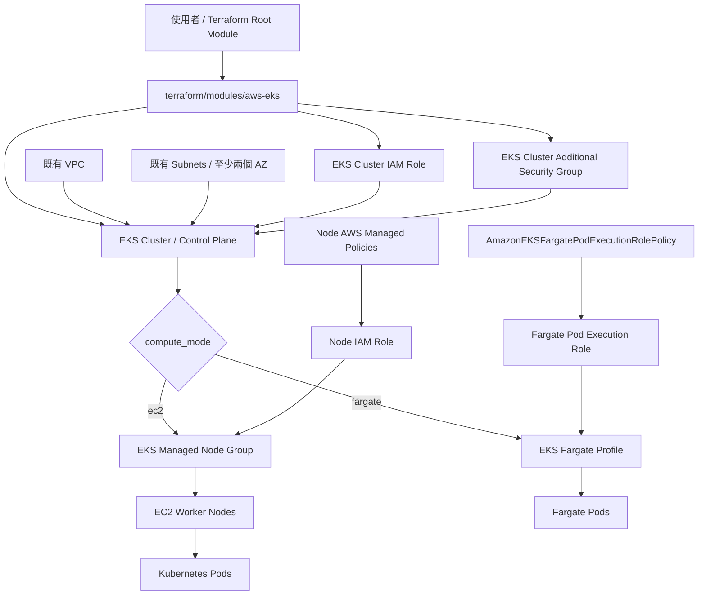
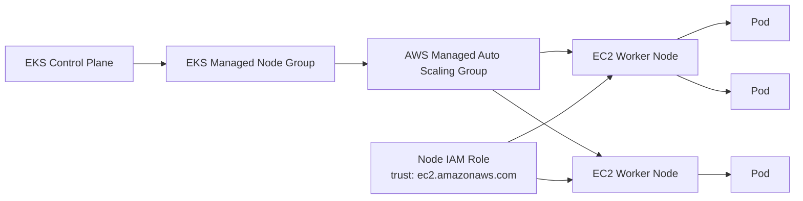
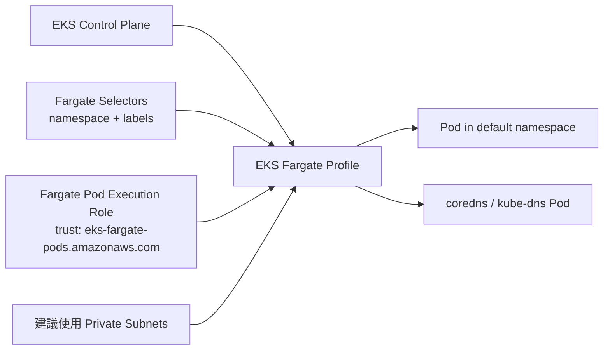
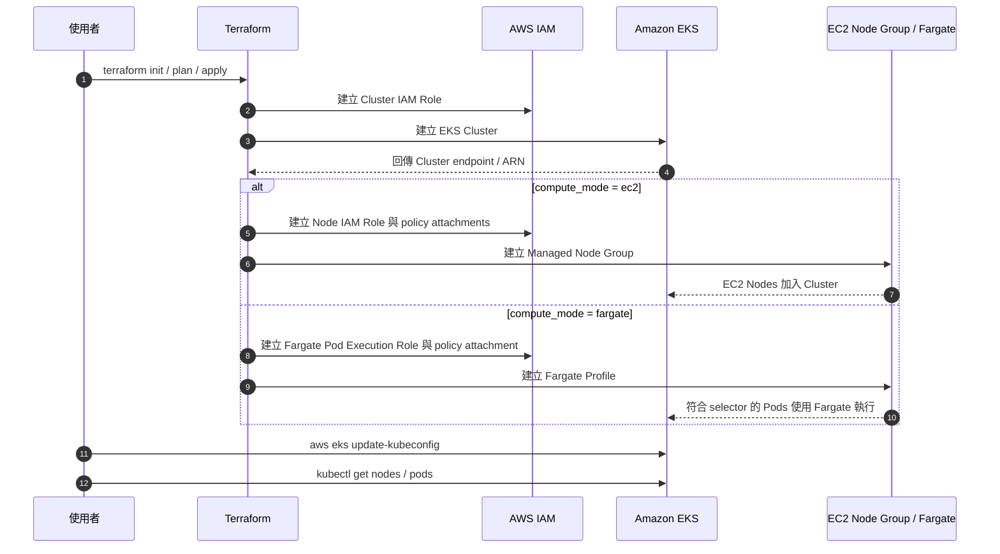
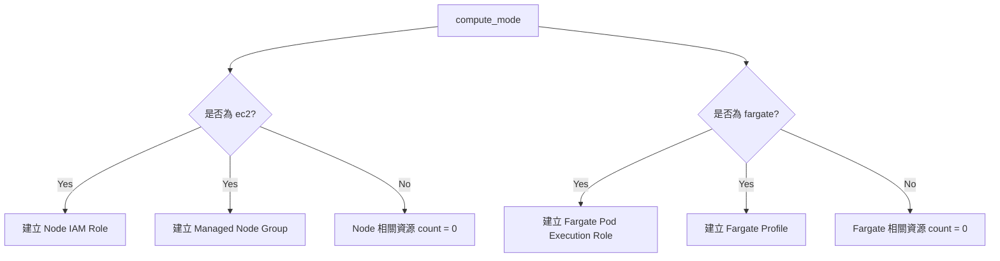

# AWS EKS Template 架構圖

本文件使用 Mermaid 補充 `terraform/modules/aws-eks` 的架構與部署流程，協助快速理解 `compute_mode = "ec2"` 與 `compute_mode = "fargate"` 的差異。

> ⚠️ 費用提醒：EKS Control Plane 會持續計費；EC2 模式會另外產生 Worker Nodes / EBS 費用，Fargate 模式則依 Pod vCPU / memory 使用量計費。練習完成請立即執行 `terraform destroy`。

## 模組整體架構

## EC2 Managed Node Group 模式

`compute_mode = "ec2"` 是預設模式，會建立 EKS Managed Node Group，Pod 會排程到 EC2 Worker Nodes 上。

### EC2 模式重點

- 會建立 `aws_eks_node_group.main`。
- 會建立 `aws_iam_role.node`，trust principal 是 `ec2.amazonaws.com`。
- 會綁定 `AmazonEKSWorkerNodePolicy`、`AmazonEKS_CNI_Policy`、`AmazonEC2ContainerRegistryReadOnly`。
- 適合學習 Worker Node、Node Group scaling、DaemonSet 與節點層級觀察。
- 成本包含 EKS Control Plane、EC2 instance 與 EBS volume。

## EKS Fargate Profile 模式

`compute_mode = "fargate"` 會建立 Fargate Profile，不會建立 EC2 Worker Nodes。符合 selector 的 Pod 會由 AWS Fargate 執行。

### Fargate 模式重點

- 會建立 `aws_eks_fargate_profile.main`。
- 會建立 `aws_iam_role.fargate_pod_execution`，trust principal 是 `eks-fargate-pods.amazonaws.com`。
- 會綁定 `AmazonEKSFargatePodExecutionRolePolicy`。
- 不會建立 EC2 Worker Nodes，也不會建立 Node Group IAM Role。
- 適合學習 Serverless Kubernetes、namespace / label selector 與 Pod 層級計費。
- 若使用 private subnet，需確認 Pod 可連到 EKS API、ECR 與必要 AWS APIs，通常需要 NAT Gateway 或 VPC Endpoints。

## 部署流程

## 資源建立條件

## EC2 與 Fargate 差異速查

| 項目 | `compute_mode = "ec2"` | `compute_mode = "fargate"` |
|------|--------------------------|-------------------------------|
| Compute 型態 | EC2 Worker Nodes | AWS Fargate Pods |
| Terraform 主要資源 | `aws_eks_node_group` | `aws_eks_fargate_profile` |
| IAM Role principal | `ec2.amazonaws.com` | `eks-fargate-pods.amazonaws.com` |
| 是否管理節點 | 需要理解 Node Group / EC2 | 不需要管理 EC2 節點 |
| 成本來源 | EKS Control Plane + EC2 + EBS | EKS Control Plane + Fargate Pod 用量 |
| 適合學習 | Kubernetes 節點、scaling、DaemonSet | Serverless Pod、selector、Pod 計費 |

## 建議閱讀順序

1. 先閱讀 [`README.md`](../README.md) 了解輸入變數與基本使用方式。
2. 再閱讀本文件的「模組整體架構」。
3. 依你要練習的模式閱讀「EC2 Managed Node Group 模式」或「EKS Fargate Profile 模式」。
4. 執行 `terraform plan` 前，確認 `public_access_cidrs` 已限制為自己的固定 IP。